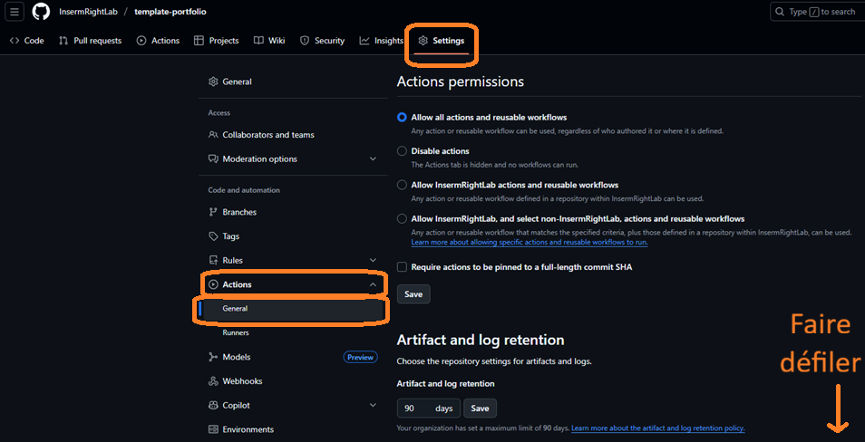
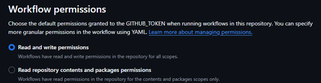
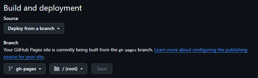

# Template portfolio UMR Right

Ce repo contient le code minimal nécessaire pour réaliser un site internet hébergé sur GitHub et présentant les diverses analyses bioinformatiques que chacun des membres du groupe de travail bioinfo maitrise et peut proposer aux divers demandeurs au sein de l'UMR Right ou collaborateurs extérieurs. Sa structure est basée sur des fichiers markdown que l'on peut modifier simplement et qui sont ensuite convertis en pages web html par Jekyll. Vous pouvez visiter mon [site](https://jviot.github.io) pour voir un exemple de rendu.

Il peut être également utilisé par tout étudiant ou personnel souhaitant avoir une présence sur GitHub, modifier cette template pour remplacer "bioinformatic analyses" par "projects" ou autre est facile et nécessite simplement de changer les titres et url sur les fichiers markdown présents dans [/_pages/](_pages/).

Pour toute question ou demande, n'hésitez pas à me [contacter](mailto:jviot@chu-besancon.fr).

## Etape 1: cloner le repo

Il faut d'abord "fork", c'est à dire cloner, le contenu de ce repo sur son propre compte GitHub. Pour cela, il suffit de cliquer sur Fork en haut à droite de cette page (voir capture d'écran), et de choisir le nom. Le nom du repo doit OBLIGATOIREMENT être de la forme pseudo.github.io, pseudo étant donc son pseudo sur GitHub. La structure de ce nom est nécessaire pour que GitHub "comprenne" que ce site internet ce situera à la racine (c'est à dire qu'on y accèdera en tapant simplement pseudo.github.io dans la barre d'adresse; à l'inverse, la structure de n'importe quel autre repo ayant un site GitHub est de la forme pseudo.github.io/nom-du-repo).

## Etape 2: modification des éléments du site

Pour modifier les fichiers, il existe deux méthodes. La première, qui ne nécessite pas de connaissance en Git, est une modification directe sur le site GitHub en cliquant sur le crayon en haut à droite quand on est sur un fichier (voir capture d'écran). Une fois modifiée, on peut ensuite "commit changes", toujours en haut à droite, pour valider ces changements.

La deuxième est plus compliquée mais moins fastidieuse puisque l'on peut modifier tous les fichiers sur son ordinateur avec un éditeur comme VSCode. Il faut pour cela utiliser Git, le logiciel, et cloner son repo sur son ordinateur ce qui télécharge tous les fichiers dans un dossier. On peut ensuite modifier ce que l'on veut, et renvoyer sur le repo GitHub ces modifications. Cela nécessite de connaitre toutes les commandes nécessaires donc git add ., git commit -m "modif", git push origin main etc, et également de configurer un token pour authentification. Si besoin, je peux former rapidement à l'utilisation de Git, qui est pour moi recommandée en bioinformatique.

### Fichier _config.yml

Le fichier principal de configuration [/_config.yml](_config.yml) est le premier à modifier, notamment nom, prénom, et surtout l'adresse url du site sous la forme https://pseudo.github.io. J'ai mis des commentaires en français sur les items à remplir en priorité, il y a beaucoup d'options, je les ai déjà pré-réglées mais si vous voulez en personnaliser certaines regardez bien le tutoriel du thème principal [/CUSTOMIZE.md](CUSTOMIZE.md).

### Fichier _pages/about.md

Le fichier [/_pages/about.md](_pages/about.md) est la page d'accueil par défaut du site. Les pages markdown possèdent en en-tête des paramètres qui ici renvoient à diverses options comme une liste de publis mise en avant (selected_papers) ou des news (announcements) (voir options désactivées ci-dessous) que vous pouvez réactiver si nécessaire. Vous pouvez mettre une introduction dans le contenu sous les paramètres (il ne faut rien rajouter entre les ---).

### Fichier _data/socials.yml

Les icones et liens des divers réseaux sociaux professionnels (LinkedIn, ResearchGate, Google Scholar etc) présents sur la page d'accueil sont configurables dans [/_data/socials.yml](_data/socials.yml). Il suffit en général de juste mettre son identifiant et non le lien vers le site.

### Dossier _projects

Le dossier [/_projects/](_projects/) contient tous les fichiers markdown qui sont autant de pages html différentes pour les analyses bioinformatiques. Il y a deux manières de construire son portfolio: soit chaque fichier markdown est une analyse, et dans ce cas on peut les catégoriser en Bulk, Single-cell etc (c'est ce que j'ai fait, mais cela peut donner vraiment beaucoup de fichiers). Les catégories se mettent dans [/_pages/projects.md](_pages/projects.md) au niveau de display_categories: entre crochets (exemple, display_categories: [Bulk RNA-seq, Single-cell RNA-seq] ce qui va classer les fichiers markdown suivants leur catégorie indiquée dans l'en-tête du markdown de l'analyse bioinformatique). 

Soit on peut créer un seul fichier markdown pour chaque type d'analyse, donc Bulk, single-cell etc, et dans ce fichier markdown mettre les diverses analyses à la suite. Par défaut j'ai enlevé les catégories dans [/_pages/projects.md](_pages/projects.md) et laissé un exemple d'analyse pour voir comment on peut construire (notamment les images, le site organise automatiquement les images quand on les met par 2 ou 3).

Pour les images en thumbnail de chaque analyse (quand on est sur la page principale de bioinformatic analyses), pour que la taille des différentes images soit identique entre les différentes analyses, il faut que le ratio de chaque image soit le même (exemple, 2 images carrées de 400x400 et de 600x600 auront la même taille au final, ou 200x300 et 400x600, parce que les ratios (1:1 dans le premier cas, 2:3 dans le second) sont les mêmes).

### Fichier _bibliography/papers.bib

Si vous avez des publications, lee fichier [/_bibliography/papers.bib](_bibliography/papers.bib) peut être rempli dans le format BibTeX. Un convertisseur Pubmed ou DOI vers BibTeX est disponible [ici](https://www.bibtex.com/c/pmid-to-bibtex-converter/). Il y a pas mal d'options d'entrées pour ce format, j'ai laissé deux exemples et sinon d'autres exemples sont présents dans le [thème](https://github.com/alshedivat/al-folio/blob/main/_bibliography/papers.bib) original.

### Couleurs du site

Les couleurs du site sont gérées par des fichiers CSS (comme n'importe quel site), [/_sass/_themes.scss](_sass/_themes.scss) et [/_sass/_variables.scss](_sass/_variables.scss). Le fichier themes contient toutes les catégories de CSS, comme le fond (background), couleur de texte, couleur de surlignage (hover) etc et les couleurs sont assignées par variable. Les couleurs elle-mêmes sont contenues dans le fichier variables, qui assigne le code hexadécimal d'une couleur à une variable. Sauf si vous voulez mettre vos propres couleurs en hexadecimal, c'est mieux de modifier uniquement le fichier themes à partir des variables déjà présentes. Enfin le fichier CSS [/_sass/_base.scss](_sass/_base.scss) contient l'intégralité des paramètres de chaque élément du site, du petit bouton à l'ombrage des vignettes, mais il faut bien connaitre le CSS avant de modifier quoique ce soit, les fichiers themes et variables sont suffisants.

### Options désactivées

Afin de ne pas surcharger d'options, j'ai désactivé un certain nombre de possibilités que la template originale contenait, en particulier des news. J'ai également désactivé d'autres options que j'utilise comme le code (liens vers des repos GitHub de code source de publications) ou CV que vous pouvez réactiver dans [/_config.yml](_config.yml) et ensuite remplir les nouvelles catégories. N'hésitez pas à regarder aussi [/CUSTOMIZE.md](CUSTOMIZE.md).

## Etape 3: Activer les workflows

Les workflows, ou actions, sont des jobs automatiques que GitHub lance à chaque fois que l'on modifie quelque chose (voir capture d'écran). Lorsque l'on fork un repo, ceux-ci sont désactivés par défaut. Ce sont ces workflows qui construisent le site, il faut donc les réactiver (je conseille de déjà modifier la plupart des fichiers de base, notamment [/_config.yml](_config.yml), avant de les réactiver). Une fois actifs, à chaque commit, le site est reconstruit (cela prend en général 5-7 minutes).

Comme j'ai désactivé moi-même en plus certains workflows de mon profil avant de le cloner sur InsermRightLab, il est possible que même après réactivation certains soient toujours désactivés, dans ce cas il faudra aller sur eux pour les réactiver (voir capture d'écran). Le plus important est Deploy site, qui est celui qui construit le site. Le workflow Prettier code formatter ne doit pas être réactivé ou alors il faut le désactiver, si celui-ci c'est activé, car il va échouer à chaque fois (pour désactiver, c'est les 3 points en haut à droite).

Ensuite, il va falloir activer plusieurs options. D'abord, il va falloir aller dans Settings -> Actions -> General et activer Workflow permissions sur "Read and write permissions" (voir captures d'écran)

Enfin, il faut modifier quelque chose sur le site pour commit cette modification et lancer la construction du site. Une fois complétée, il faut de nouveau aller dans Settings -> Pages et mettre la branche sur gh-pages (voir capture d'écran)

Le site devrait maintenant fonctionner en allant sur son adresse https://pseudo.github.io !
